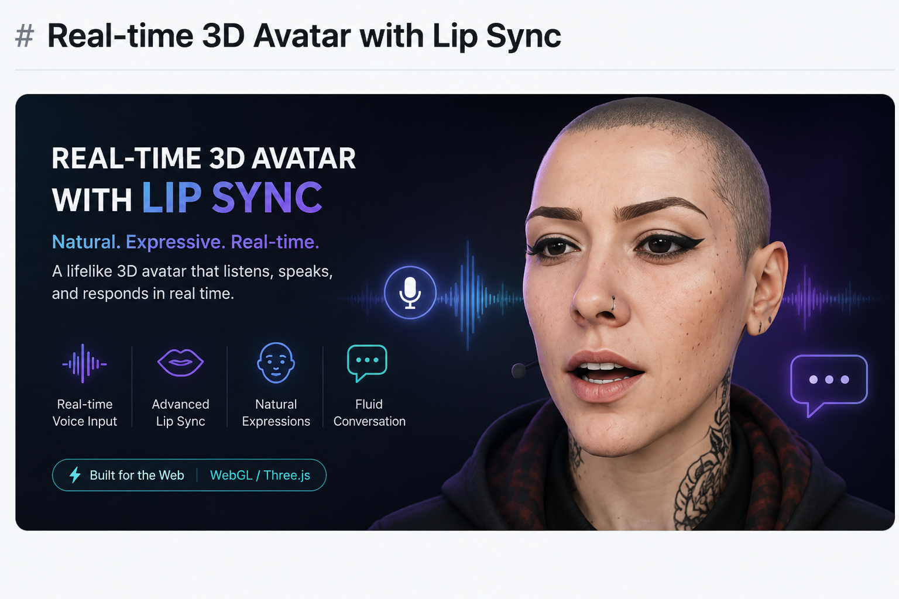

# Talking Head — avatar vocal incarné (web)



**Nora** — une assistante 3D qui **parle** : micro → LLM (API externe) → voix (Piper) → visèmes (Rhubarb) → lip-sync temps réel dans le navigateur (three.js).

Le **rendu 3D tourne dans le navigateur du visiteur** (aucune charge GPU serveur). Le container ne fait que : servir le front, la synthèse vocale, les visèmes, et l'appel LLM.

## Contenu
```
web/
  public/            front three.js (servi statiquement)
    index.html       viewer + lipsync + micro (Web Speech API)
    avatar.glb       mesh + 11 morph targets (visèmes A–H + blink/browUp/browFurrow)
    vendor/          three.js (local, pas de CDN)
  server.js          Express : /api/say, /api/chat
  Dockerfile         Node + ffmpeg + Piper (voix FR) + Rhubarb
  docker-compose.yml
  .env.example       config (clé LLM, personnalité…)
```

## API
- `POST /api/say  { text }` → `{ audio(base64 wav), mime, cues }`
- `POST /api/chat { text, history? }` → `{ reply, audio, mime, cues }` (appelle le LLM puis synthétise)
- `GET  /api/health`

## Config (variables d'environnement)
Copier `.env.example` → `.env` et remplir :
- `LLM_API_BASE` / `LLM_API_KEY` / `LLM_MODEL` — n'importe quelle API compatible OpenAI (`/chat/completions`) : OpenAI, Groq, OpenRouter, Mistral, Together, un vLLM…
- `SYSTEM_PROMPT` — la personnalité (voix, courte, FR).

La clé LLM reste **côté serveur** — jamais envoyée au navigateur.

## Déployer sur Coolify (VPS)
1. Pousser ce dossier `web/` dans un repo Git.
2. Coolify → New Resource → **Dockerfile** (ou Docker Compose) → pointer sur ce repo.
3. Renseigner les variables d'env (au moins `LLM_API_KEY`, `LLM_API_BASE`, `LLM_MODEL`).
4. Port applicatif **3000**. Coolify gère le domaine + HTTPS.
5. Deploy. Ouvrir l'URL, autoriser le micro, cliquer **🎤 Parler**.

> ⚠️ Le micro (Web Speech API) exige **HTTPS** (ou localhost). Coolify fournit le HTTPS, donc OK en prod.

## Tester en local (Docker)
```bash
cp .env.example .env   # mettre ta clé
docker compose up --build
# http://localhost:3000
```

## Régénérer l'avatar (si le rig change)
Depuis `lipsync/` :
```bash
blender --background ../antifa_bust_rigged_weight2_fixed.blend \
        --python web/bake_visemes_glb.py -- web/public/avatar.glb
```

## Notes
- STT = **Web Speech API** (navigateur, gratuit) — Chrome/Edge le supportent bien en `fr-FR`.
- TTS = **Piper** voix `fr_FR-siwis-medium` (changeable dans le Dockerfile / `PIPER_VOICE`).
- Idle (clignements, sourcils) piloté en JS côté front via les morphs `blink`/`browUp`.

## Licence
[MIT](LICENSE) © 2026 Paul Woisard
